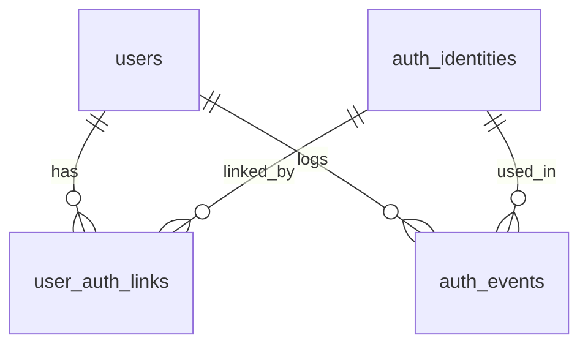

# 260514_01_인증데이터모델초안_#5

## 문서 목적
인증 주제 테이블의 개요/관계/규칙을 설명하고, 상세 컬럼은 주제별 테이블 문서로 분리 관리한다.

## 1. 테이블 개요 (ID/명칭)
| 테이블ID | 테이블명 | 역할 | 상세 문서 |
| :--- | :--- | :--- | :--- |
| TB_AUTH_USER | users | 회원 기본 정보 | [01_users.md](./01_users.md) |
| TB_AUTH_IDENTITY | auth_identities | 인증수단 원본 정보 | [02_auth_identities.md](./02_auth_identities.md) |
| TB_AUTH_LINK | user_auth_links | 회원-인증수단 매핑 | [03_user_auth_links.md](./03_user_auth_links.md) |
| TB_AUTH_EVENT | auth_events | 인증 이벤트 이력 | [04_auth_events.md](./04_auth_events.md) |

## 2. KEY / FK 관계

### 2.1 PK(Primary Key)
| 테이블ID | PK 컬럼 |
| :--- | :--- |
| TB_AUTH_USER | `user_id` |
| TB_AUTH_IDENTITY | `auth_id` |
| TB_AUTH_LINK | `link_id` |
| TB_AUTH_EVENT | `event_id` |

### 2.2 FK(Foreign Key)
| FK명(권장) | 자식 테이블(컬럼) | 부모 테이블(컬럼) | 관계 |
| :--- | :--- | :--- | :--- |
| FK_AUTH_LINK_USER | TB_AUTH_LINK(`user_id`) | TB_AUTH_USER(`user_id`) | N:1 |
| FK_AUTH_LINK_AUTH | TB_AUTH_LINK(`auth_id`) | TB_AUTH_IDENTITY(`auth_id`) | N:1 |
| FK_AUTH_EVENT_USER | TB_AUTH_EVENT(`user_id`) | TB_AUTH_USER(`user_id`) | N:1 |
| FK_AUTH_EVENT_AUTH | TB_AUTH_EVENT(`auth_id`) | TB_AUTH_IDENTITY(`auth_id`) | N:1 |

### 2.3 UK(Unique Key, 권장)
| UK명(권장) | 테이블ID | 컬럼 | 목적 |
| :--- | :--- | :--- | :--- |
| UK_AUTH_IDENT_PROVIDER_SUBKEY | TB_AUTH_IDENTITY | (`provider_cd`, `provider_key_val`) | 인증수단 중복 방지 |
| UK_USER_AUTH_LINK | TB_AUTH_LINK | (`user_id`, `auth_id`) | 동일 회원-인증수단 중복 연결 방지 |

## 3. ER 요약

## 4. 상세 테이블 문서 링크
- [users](./01_users.md)
- [auth_identities](./02_auth_identities.md)
- [user_auth_links](./03_user_auth_links.md)
- [auth_events](./04_auth_events.md)
- [테이블 관리대장](../00_테이블관리대장.md)

## 5. 공통 규칙
1. 모든 테이블 메타정보 6종 필수
   - reg_system, reg_user_id, reg_dtm, mod_system, mod_user_id, mod_dtm
2. 컬럼명 규칙
   - 용어 단위 + 도메인 suffix
3. 사전 참조
   - [단어사전](../../00_사전관리/01_단어사전.md)
   - [용어사전](../../00_사전관리/02_용어사전.md)
   - [도메인사전](../../00_사전관리/03_도메인사전.md)
   - [공통코드사전](../../00_사전관리/04_공통코드사전.md)

### 작성 이력
| 작업일시 | 작업 에이전트 | 내용 한 줄 요약 |
| :--- | :--- | :--- |
| 2026-05-14 00:00 UTC | Codex (GPT-5.3-Codex) | 이슈#5 인증 데이터모델초안 문서를 데이터관리/테이블관리로 이동 및 분리관리 구조로 개편 |
| 2026-05-15 00:00 UTC | Codex (GPT-5.3-Codex) | 테이블ID/테이블명 및 PK/FK/UK 관계 표를 추가해 모델 개요 보강 |
