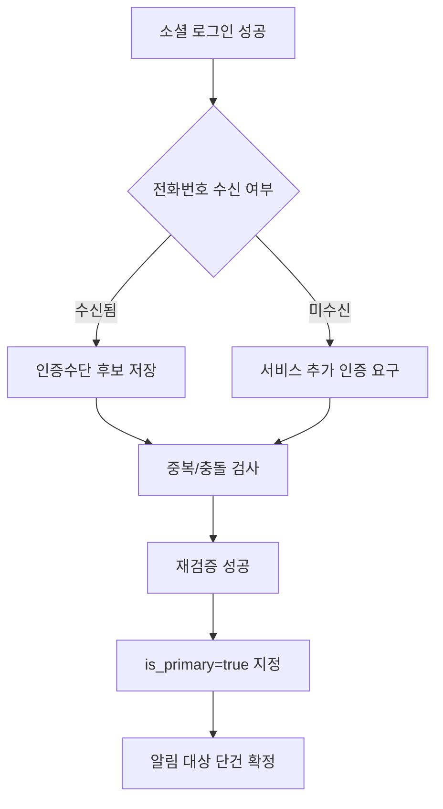

# 06. 소셜로그인 API 전화번호 검증 가이드 (카카오/네이버/구글)

## 1. 목적
이슈 #5(소셜 인증) 구현 시, **전화번호 기반 검증 가능 여부**를 기준으로 카카오/네이버/구글 로그인 API의 요청·응답·적용 절차를 정리한다.

## 2. 결론 요약
- **카카오**: 사용자 동의 및 계정 상태에 따라 전화번호(`phone_number`) 수신 가능. 단, 미제공 케이스 존재.
- **네이버**: 프로필 조회 응답에서 `mobile`(휴대전화번호) 필드 제공 가능(동의 필요).
- **구글**: 기본 OIDC 로그인만으로 전화번호를 보장하지 않음. 전화번호가 필요하면 **People API + 추가 스코프(`user.phonenumbers.read`)** 연동 필요.

> 따라서 “소셜 로그인 결과만으로 전화번호를 100% 확보”는 불가능하며, 미수신 시 서비스 내 보완 인증(문자 인증 등) 플로우가 필요하다.

---

## 3. 제공사별 상세

## 3.1 카카오 로그인

### A) 요청 정보(핵심)
| 구분 | 값/설명 |
| :--- | :--- |
| 인가 엔드포인트 | `https://kauth.kakao.com/oauth/authorize` |
| 토큰 엔드포인트 | `https://kauth.kakao.com/oauth/token` |
| 사용자정보 API | `https://kapi.kakao.com/v2/user/me` |
| 주요 파라미터 | `client_id`, `redirect_uri`, `response_type=code`, `scope`, `state` |
| 전화번호 관련 scope | 카카오 계정 전화번호 동의 항목(앱 콘솔 동의항목 설정 필요) |

### B) 응답 정보(전화번호 관점)
- 사용자정보 조회 응답에서 `kakao_account.phone_number` 사용.
- 단, 사용자 상태(예: 카카오톡 미사용 등)에 따라 전화번호 값이 비어 있을 수 있다.
- 동의여부/재동의 필요성은 동의 관련 플래그(`*_needs_agreement`) 확인 후 추가 동의 요청으로 보완.

### C) 적용 절차
1. Kakao Developers 앱 생성 및 Redirect URI 등록
2. 동의항목(전화번호 포함) 설정
3. 인가코드 발급 → 토큰 발급
4. `/v2/user/me` 호출로 사용자정보 조회
5. 전화번호 수신 실패 시 서비스 내 추가 인증수단으로 보완

### D) 구현 시 주의
- 카카오 보안 가이드에서도 전화번호는 소유자 변경 가능성이 있어, 문자열 단순 비교에 의존하지 말 것을 권고.
- 내부 식별은 `service user id`(카카오 앱 기준 유니크) 중심으로 관리.

---

## 3.2 네이버 로그인

### A) 요청 정보(핵심)
| 구분 | 값/설명 |
| :--- | :--- |
| 인가 엔드포인트 | `https://nid.naver.com/oauth2.0/authorize` |
| 토큰 엔드포인트 | `https://nid.naver.com/oauth2.0/token` |
| 회원 프로필 API | `https://openapi.naver.com/v1/nid/me` |
| 주요 파라미터 | `response_type=code`, `client_id`, `redirect_uri`, `state` |
| 인증 헤더 | `Authorization: Bearer {access_token}` |

### B) 응답 정보(전화번호 관점)
- 회원 프로필 응답의 `response.mobile` 필드가 휴대전화번호.
- 정보제공 동의가 없거나 사용자 프로필 상태에 따라 누락 가능.

### C) 적용 절차
1. NAVER Developers 앱 등록 및 로그인 API 설정
2. 인가코드/토큰 발급
3. `/v1/nid/me` 호출로 프로필 조회
4. `mobile` 존재 여부 확인 후 내부 인증수단 링크
5. 누락 시 추가 본인확인 절차 수행

---

## 3.3 구글 로그인

### A) 요청 정보(핵심)
| 구분 | 값/설명 |
| :--- | :--- |
| OIDC 인가 | Google Identity/OAuth 2.0 (`openid profile email`) |
| 기본 사용자정보 | ID Token / UserInfo (기본은 프로필·이메일 중심) |
| 전화번호 확장 API | People API `people.get` |
| 전화번호 스코프 | `https://www.googleapis.com/auth/user.phonenumbers.read` |
| 조회 마스크 | `personFields=phoneNumbers` |

### B) 응답 정보(전화번호 관점)
- 기본 OIDC 로그인 응답(ID Token/UserInfo)에는 전화번호가 일반적으로 포함되지 않는다.
- People API 연동 시 `phoneNumbers[]`에서 번호 조회 가능(권한/동의/계정 상태 의존).

### C) 적용 절차
1. Google Cloud 프로젝트/OAuth 동의화면/클라이언트 설정
2. 로그인에 `openid profile email` 적용
3. 전화번호가 필요한 경우 추가 동의 스코프(`user.phonenumbers.read`) 요청
4. People API `people.get` 호출(`personFields=phoneNumbers`)
5. 미수신 시 서비스 보완 인증 플로우 수행

### D) 구현 시 주의
- 구글은 제공 범위가 계정/동의 상태에 따라 달라 전화번호 100% 보장 불가.
- OIDC(인증)와 People API(프로필 데이터) 단계를 분리해 설계 필요.

---

## 4. 전화번호 검증 정책 제안(권장)
1. 소셜 제공 번호는 “참조값”으로 수집하되, 핵심 본인확인은 서비스 자체 OTP/SMS 재검증으로 확정
2. 알림 발송 대상은 `verified=true AND is_primary=true` 단건만 사용
3. 번호 변경 시 구번호는 이력으로 보관하되 알림 발송 제외
4. 제공사 미수신(Null/미동의) 케이스를 정상 경로로 취급해 UX 설계

## 5. 권장 구현 흐름 (Mermaid)

## 7. 자주 묻는 질문(검토 피드백 반영)

### Q1) 그래서 검증된 전화번호를 수집할 수 있나?
- **수집 가능**하다. 다만 제공사 동의/계정상태/국가 정책에 따라 **항상 보장되지는 않는다**.
- 운영 설계는 "수신 성공"과 "미수신"을 모두 정상 경로로 처리해야 한다.

### Q2) 구현 가능한가?
- **가능**하다.
- 권장 구현:
  1) 소셜 로그인 후 제공 전화번호 수신 시 후보값 저장
  2) 서비스 자체 OTP/SMS 재검증으로 `verified=true` 확정
  3) `is_primary=true` 연락처 1건만 알림 발송

### Q3) 카카오/네이버/구글 중 안 되는 곳이 있나?
- **카카오**: 전화번호 필드 수신 가능(동의/계정 상태 의존)
- **네이버**: `mobile` 수신 가능(동의 의존)
- **구글**: 기본 OIDC만으로는 사실상 어려우며, People API + 추가 스코프 필요
- 결론: "완전 불가"라기보다 **구글은 추가 API/스코프 없이 전화번호 수집이 어렵다**.

### Q4) 간편인증 말고 휴대폰 문자인증은 무료로 가능한가?
- **완전 무료 상용 운영은 현실적으로 어렵다.** 통신사/메시징 사업자 비용이 발생한다.
- 다만 일부 서비스는 개발/체험 단계 무료 크레딧 또는 테스트 모드를 제공할 수 있다.
- 비용 검토 시 최소 확인 항목:
  - 발송 단가(국가/통신사별)
  - 발신번호(번호 임대/등록) 비용
  - 규제/등록(예: A2P 등) 비용

## 6. 출처
- Kakao Login 활용/설정/FAQ/REST API 문서:  
  - https://developers.kakao.com/docs/en/kakaologin/utilize  
  - https://developers.kakao.com/docs/en/kakaologin/prerequisite  
  - https://developers.kakao.com/docs/latest/en/kakaologin/faq  
  - https://developers.kakao.com/docs/latest/en/kakaologin/rest-api
- NAVER 로그인 프로필 API 문서:  
  - https://developers.naver.com/docs/login/profile/profile.md
- Google OIDC / People API 문서:  
  - https://developers.google.com/identity/openid-connect/openid-connect  
  - https://developers.google.com/people/api/rest/v1/people/get  
  - https://developers.google.com/people/api/rest/v1/people
- SMS 발송 비용 참고(무료 여부 판단):  
  - https://www.twilio.com/en-us/sms/pricing/usa  
  - https://aws.amazon.com/sns/sms-pricing

### 작성 이력
| 작업일시 | 작업 에이전트 | 내용 한 줄 요약 |
| :--- | :--- | :--- |
| 2026-05-14 00:00 UTC | Codex (GPT-5.3-Codex) | 카카오/네이버/구글 소셜로그인 API의 전화번호 검증 가능성, 요청/응답/적용절차를 기술관리 문서로 정리 |
| 2026-05-14 00:00 UTC | Codex (GPT-5.3-Codex) | 다음 세션 시작 포인트: 제공사별 전화번호 미수신률을 실제 테스트로 계측해 기본 UX(추가인증 진입조건) 확정 |
| 2026-05-14 00:00 UTC | Codex (GPT-5.3-Codex) | 비용/구현 가능 여부 FAQ(전화번호 수집 가능성, 구글 제약, SMS 무료 여부) 추가 |
